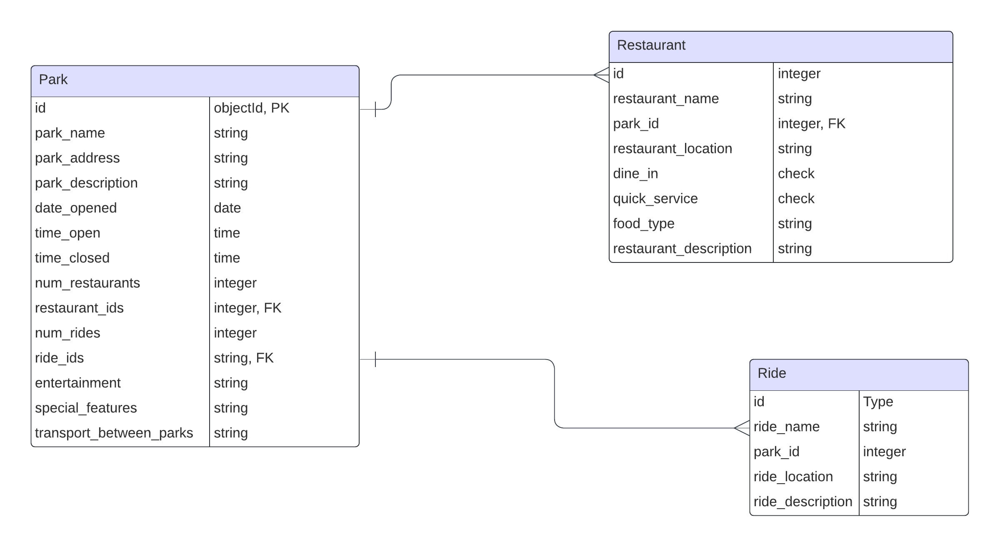
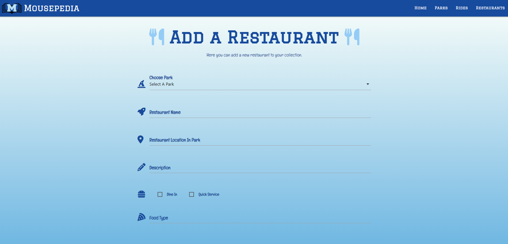

# Mousepedia


### All things Disney...


Mousepedia was created for my 3rd Milestone project for Code Institute's Level 5 Diploma in Web Application Development.

Link to deployed site - [Mousepedia](https://mousepediadb-0e4030391623.herokuapp.com/parks)

## CONTENTS

- [Mousepedia](#mousepedia)
  - [CONTENTS](#contents)
  - [Site Objectives](#site-objectives)
- [User Experience/UX](#user-experienceux)
  - [Target Audience](#target-audience)
  - [User Stories](#user-stories)
    - [New Visitor Goals](#new-visitor-goals)
    - [Existing Visitor Goals](#existing-visitor-goals)
- [Design Choices](#design-choices)
  - [Colour Scheme](#colour-scheme)
  - [Typography](#typography)
  - [Logo and Favicon](#logo-and-favicon)
- [Database Schema & User Journey](#database-schema--user-journey)
  - [Wireframes](#wireframes)
  - [Flow Diagram](#flow-diagram)
  - [Database Plan](#database-plan)
- [Features](#features)
  - [Future Implementations](#future-implementations)
  - [Accessibility](#accessibility)
- [Technologies Used](#technologies-used)
- [Programming Languages, Frameworks and Libraries Used](#programming-languages-frameworks-and-libraries-used)
- [Defensive Programming](#defensive-programming)
- [Testing](#testing)
  - [Manual Testing](#manual-testing)
  - [User](#user)
  - [Bugs](#bugs)
  - [Lighthouse](#lighthouse)
  - [Validation Testing](#validation-testing)
    - [HTML & CSS](#html--css)
  - [Python Testing](#python-testing)
  - [Deployment](#deployment)
    - [Github Deployment](#github-deployment)
    - [Creating a Fork or Copying](#creating-a-fork-or-copying)
    - [Clone](#clone)
    - [Repository deployment via Heroku](#repository-deployment-via-heroku)
    - [Deployment of the app](#deployment-of-the-app)
  - [Credits](#credits)
  - [Media](#media)
  - [Acknowledgments and Thanks](#acknowledgments-and-thanks)

___

## Project Goals

Design and create a database that holds records for detailing Disney Theme Parks, rides and restaurants, and displays these records on the frontend. This project was created as I am a big fan of Disney and the Disney parks and thought it would fulfil a need of having all the information you require in one place with the ability for it to be completely customised for the user.

- ### Create a clear, readable and intuitive front end display

  I wanted the point of the website to be easily understood from the home page and for the user to be able to easily navigate the website where they can add, edit and delete the records that they have entered onto the database.

- ### Make use of available backend functionality

  The use of the backend framework allows users to create, edit and delete records of their choosing.

- ### Store data on an external cloud database

  I used Code Institute's Postgres database server to store the PostgreSQL database for this project.

___

# User Experience/UX

## Target Audience

- The target audience for Mousepedia is Disney fans who are planning a trip to the Disney parks in Florida, or if they purely want to collect and organise information about the Disney parks.

## User Stories

### New Visitor Goals

<h4>As a first time user, I want to be able to:</h4>

  - Understand the concept of the website and how to use it.
  - To view existing records, if any are available.
  - Add records if they do not already exist.

### Returning Visitor Goals

<h4>As a returning user, I want to be able to:</h4>

  - Find the existing Disney park information easily.
  - See which rides and restaurants are in each park.
  - Edit and delete existing records.

___

# Design Choices

## Colour Scheme

The colour scheme used for this project was based on the colors from the Disney Parks website, but in conjunction with the choice provided by the Materialize framework. This provides the user with some familiarity whilst providing enough contrast between the website elements and text.

For the background of all pages, I created a gradient obtained from [CSS Gradient](https://cssgradient.io/), using the below colours:


The rest of the elements use the above colours and some colours for small details were slightly different shades to the below, but the main colours used are below:


## Typography

Google fonts were used to import fonts for use in the project.

For the main logo featured on the navbar and titles throughout the pages, I used the google font 'Graduate'. I used this as it was clear, easy to read and had a varsity style, which reminds me of Disney and has also been used on a large amount of recent merchandise.


For the body of the page, I used Englebert which again, is clear and easy to read. I also felt the cartoonish nature of the font, reminded me of Disney.


## Logo and Favicon

The logo was made by myself in procreate, using the Graduate font for the M to link to Mousepedia but that steers away from any copyright infringement. The favicon I used was obtained from [Favicon.io](https://favicon.io/), generated using the following graphics from Twitter Twemoji:

- Graphics Title: 1f3f0.svg
- Graphics Author: Copyright 2020 Twitter, Inc and other contributors (https://github.com/twitter/twemoji)
- Graphics Source: https://github.com/twitter/twemoji/blob/master/assets/svg/1f3f0.svg
- Graphics License: CC-BY 4.0 (https://creativecommons.org/licenses/by/4.0/)

## Wireframes

- Home page
    

- Parks page
  This shows the park records displayed as cards and the card reveal on the last card for when the card is clicked (desktop example only).
    

- Rides/Restaurants page
    

- Add/Edit page
  Only shown one example as the add/edit layout is very similar across the pages.
    

- Delete Modal
  If user decides to click delete on any records, this modal will appear to confirm the choice. Also, note the flash message that appears at the top of the page to feedback to user that the add/edit/delete has been successful.
    

## Database Schema & User Journey

### Flow Diagram

Here is a diagram showing the possible flow/user journey through the site.


## Database Schema

The database schema/plan is fairly simple, but it shows the information that is stored within the database, the type of data and if it is logged as a Primary or Foreign key where applicable.



# Features

This website consists of 11 pages, all of which are extended from the base page.

- Home page
- Parks page
- Rides page
- Restaurant page
- Add Park page
- Add Ride page
- Add Restaurant page
- Edit Park page
- Edit Ride page
- Edit Restaurant page
- 404 Error Page

### General features across all pages
  - Favicon: Created at [Favicon.io](https://favicon.io/), I chose the image of the castle to represent the parks, which are most known for the Cinderella Castle.
  - Navbar & Footer: Features on all pages, the nav bar is comprised of an image logo with text title which is a clickable link back to the homepage and four interactive links; Home, Parks, Rides and Restaurants, the background of each link will change to a darker colour when hovered over and the current page is the same colour but constant to show the user what page they are on and where they are hovering over with the cursor.
  The footer has a small amount of text about the site, along with some useful links and copyright year and information.

    

    

    

    

  - Responsive across all devices, using Materialize framework.
    

  - User feedback on buttons to show when they are hovered over.
    

  - Feedback for user if no records exist (on parks, rides and restaurants page)
    

  - Tooltip appears on parks card to encourage user to click on card to display park information.
    

---

## Home page
  

## Parks page
  

## Rides page
  

## Restaurants page
  

## Add Parks page
  

## Edit Parks page
  

## Add Rides page
  

## Edit Rides page
  

## Add Restaurants page
  

## Edit Restaurants page
  

## 404 Error page
  

----

## Future Implementations
  For future implementations, I would like to:
- Add a login feature so that not all users to the site can add/edit/delete records. Due to time constraints, I was not able to implement this properly.
- Add features to showcase all of the Disney parks globally, and other Disney properties, including all information about shopping areas such as Disney Springs and all information for Disney Hotels.
- Add a feature to leave a review for any park/ride/restaurant record.
- Add feature to include picture of ride/restaurant.
- Add feature to upload your own pictures to appear on the front end record displays.

## Accessibility

I have kept accessibility in mind whilst building the project, to make sure it is accessible as possible.
  - Using semantic HTML.
  - Providing information for screen readers where there are icons used and no text.
  - Ensuring that there is a sufficient colour contrast throughout the site.
___

# Technologies Used

Here are the technologies used to build this project:

- [Gitpod](https://www.gitpod.io/) To build and create this project
- [Github](https://github.com) To host and store the data for the site.
- [Git](https://git-scm.com/) The git command was used for version control via the terminal in Gitpod, to commit to Git and Push to GitHub.
- [PEP8 Validator](https://pep8ci.herokuapp.com/) Used to check python code for errors
- [PostgreSQL](https://www.postgresql.org/) Code Institute PostgreSQL Database Server was used to store PostgreSQL database.
- [Heroku](https://id.heroku.com/) Used to deploy the project
- [Google Fonts](https://fonts.google.com/) Used by importing the fonts Graduate & Englebert, into the style.css file which has been used on all pages within the project.
- [Font Awesome](https://fontawesome.com/) Font Awesome was used to add icons for aesthetic purposes.
- [Am I Responsive?](https://ui.dev/amiresponsive) To show the website image on a range of devices.
- [Lucid Chart](https://www.lucidchart.com/) To create the database schema.
- [Balsamiq](https://balsamiq.com/) Balsamiq was used to create wireframes.
- [Google Developer Tools](https://developer.chrome.com/docs/) To troubleshoot and test features, solve issues with responsiveness and styling.
- [Procreate](https://procreate.com/) Used to design the logo for the nav bar.

# Programming Languages, Frameworks and Libraries Used

- [HTML](https://developer.mozilla.org/en-US/docs/Web/HTML)
- [CSS](https://developer.mozilla.org/en-US/docs/Learn/Getting_started_with_the_web/CSS_basics)
- [Python](https://en.wikipedia.org/wiki/Python_(programming_language))
- [Materialize CSS](https://materializecss.com/)
- [Flask](https://pypi.org/project/Flask/)
- [SQLAlchemy](https://pypi.org/project/SQLAlchemy/)
- [PIP](https://pypi.org/project/pip/) - Used to install packages

# Defensive Programming
I have used defensive programming within my project by using a pop up modal for when a user tries to delete a record as it is the only process the user would not be able to come back from.
When a user clicks the delete button on a record, a modal pops up asking "Are you sure you want to delete this park/ride/restaurant? This action cannot be undone", The delete button is in red to make sure it stands out while the safe option "cancel" is in green so this will more likely be pressed if a mistake is made.


___

## Deployment

### Github Deployment

The website was stored using GitHub for storage of data and version control. To do this I did the following;

After each addition, change or removal of code, in the terminal within your IDE type:

- git add .
- git commit -m "meaningful commit message"
- git push

The files are now available to view within your github repository.

### Creating a Fork or Copying

To fork the repository:

  1. Log in (or sign up) to Github.

  2. Go to the repository for this project, [Mousepediadb](https://github.com/veebee4/mousepediadb).

  3. Click the Fork button in the top right corner.

### Clone

To clone the repository:

  1. Log in (or sign up) to GitHub.

  2. Go to the repository for this project, [Mousepediadb](https://github.com/veebee4/mousepediadb).

  3. Click on the code button, select whether you would like to clone with HTTPS, SSH or GitHub CLI and copy the link shown.

  4. Open the terminal in your code editor and change the current working directory to the location you want to use for the cloned directory.

  5. Type the following command in the terminal (after the git clone you will need to paste the link you copied in step 3 above):

  ```bash
  git clone { & THE LINK FROM STEP 3 }
  ```

  6. Set up a virtual environment (this step is not required if you are using the Code Institute Template in GitPod as this will already be set up for you).

  7. Install the packages from the requirements.txt file by running the following command in the Terminal:

  ```bash
    pip3 install -r requirements.txt
  ```

### Repository deployment via Heroku

The site is deployed using Heroku. To deploy to Heroku:
  - To successfully deploy on Heroku we first need to create some files, if not already existing: a requirements.txt file and a Procfile.

  - The requirements.txt file contains all the applications and dependencies that are required to run the app. To create the requirements.txt file run the following command in the terminal:

```bash
pip3 freeze --local > requirements.txt
```

  - The Procfile tells Heroku which files run the app and how to run it. To create the Procfile run the following command in the terminal:

```bash
echo web: python app.py > Procfile
```

NOTE: The Procfile uses a capital P and doesn't have a file extension on the end.

If you have successfully created the Procfile you will see the Heroku logo next to the file name. Check the Procfile contents, as sometimes on creation, a blank line will be added at the end of the file. This can sometimes cause problems when deploying to Heroku, so if the file contains a blank line at the end, delete this and save the file. Make sure to save both these files and then add, commit and push them to GitHub.

1. Login (or sign up) to Heroku.com.

2. Click the new button and then click create new app.

3. You will then be asked to give your app a name (must be unique) and select a region. Once these are completed click create app.

4. You will now need to connect the Heroku app to the GitHub repository for the site. Select GitHub in the deployment section, find the correct repository for the project and then click connect. A choice is offered between manual or automatic deployment whereby the app is updated when changes are pushed to GitHub.

5. Once the repository is connected, you will need to provide Heroku some config variables it needs to build the app. Click on the settings tab and then click reveal config vars button. You will now need to add the environment key/value variables except Development and DB_URL that were used in the env.py file:

    | KEY | VALUE |
    | :-- | :-- |
    | DATABASE_URL | database_url* |
    | IP | 0.0.0.0 |
    | PORT | 5000 |
    | SECRET_KEY| your_secret_key* |
    | DEBUG | TRUE** |

    *Denotes a value that is specific to your app.

    **Delete this config var once you are done with debugging, as this causes issues and must not be used in the submitted project/production.

6. You're now ready to click the enable automatic deploys and create button. Heroku will start building the app.

7. As this project utilises a relational database, there are a few more steps to set this up:
  * On the heroku dashboard go to resources tab and then select add-ons. You will need to search for and select heroku postgres. Select the lowest tier.
  * We will now need to go the more button on the dashboard and select run console. This is where we will set up the tables in the database we have just created.
  * Type python3 and then once the python interpreter opens, we can run the following:

  ```bash
  from mousepediadb import db
  db.create_all()
  exit()
  ```

8. Now that the relational database has been set up and the tables created, we can now click open app and the mousepedia application should now open in a new tab.

___

## Credits

### Code Used

This project was created using the Code Institute walkthrough taskmanager project. From this base I customised the layout and styling with the Materialize framework and custom CSS.

To create my 404 error page and route, I followed [this](https://www.youtube.com/watch?app=desktop&v=50N7K4oDF4g) tutorial.
To add flash messages for feedback to the user, I used [this](https://flask.palletsprojects.com/en/2.3.x/patterns/flashing/) documentation.
In order to get the nav links to show as active, I used [this](https://craftcms.stackexchange.com/questions/4234/how-to-add-active-class-to-homepage-nav-list-item) stack exchange question.
To make colour gradient stretch the whole page, I used [this](https://stackoverflow.com/questions/16841323/making-gradient-background-fill-page-with-css) tutorial.

Once complete, the readme file was passed through a spelling and grammar check via [Grammarly](https://www.grammarly.com/)

___

## Media

Favicon, obtained from [Favicon.io](https://favicon.io/), generated using the following graphics from Twitter Twemoji:
- Graphics Title: 1f3f0.svg
- Graphics Author: Copyright 2020 Twitter, Inc and other contributors (https://github.com/twitter/twemoji)
- Graphics Source: https://github.com/twitter/twemoji/blob/master/assets/svg/1f3f0.svg
- Graphics License: CC-BY 4.0 (https://creativecommons.org/licenses/by/4.0/)

Logo was created by me using the Procreate programme.
All other images on the site are personal to the user, as they are links entered onto the forms and for personal use only. 
The links I have used are from the Wikipedia pages for each park and can be attributed to the following people:
- EPCOT : [Jedi94](https://commons.wikimedia.org/w/index.php?title=User:Jedi94&action=edit&redlink=1)
- MAGIC KINGDOM : [Jedi94](https://commons.wikimedia.org/w/index.php?title=User:Jedi94&action=edit&redlink=1)
- ANIMAL KINGDOM : [Jedi94](https://commons.wikimedia.org/w/index.php?title=User:Jedi94&action=edit&redlink=1)
- HOLLYWOOD STUDIOS : [Alexf](https://commons.wikimedia.org/wiki/User:Alexf)

___

## Acknowledgments and Thanks

I would like to acknowledge the following people for helping me to complete this project:
  - My spouse who has provided support at home and while doing the project.
  - My Code Institute Mentor Jubril Akolade, for providing helpful tips and guidance.
  - My College Tutor, Rachel Furlong for always being so helpful and providing great guidance.
  - Code Institute Tutor Support; Roman, Oisin, Holly and Roo who provided me with help a long the way.

