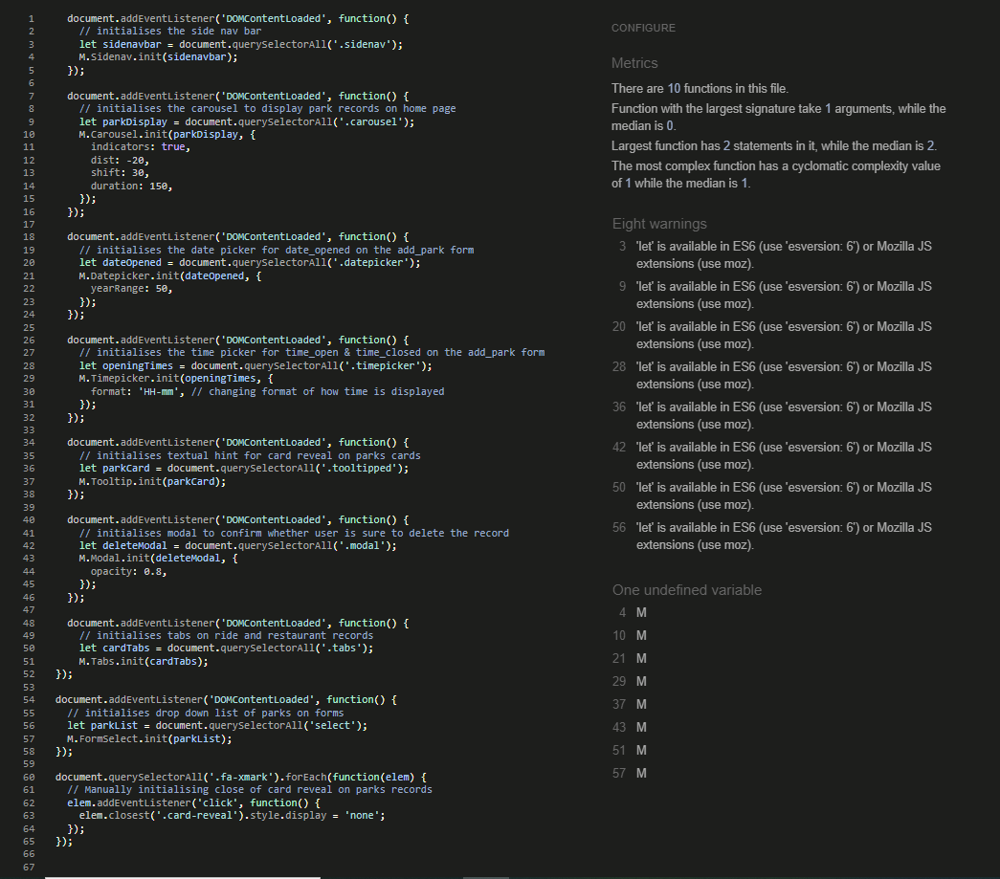

# Mousepedia - Testing

Visit the deployed website: [Mousepedia](https://mousepediadb-0e4030391623.herokuapp.com)

# CONTENTS

* [MANUAL TESTING](#manual-testing)
  * [Testing User Stories](#testing-user-stories)
    * [First Time Visitor](#first-time-visitor)
    * [Returning Visitor](#returning-visitor)
  * [Full Testing](#full-testing)
    * [Home Page](#home-page)
    * [Parks](#parks)
    * [Rides](#rides)
    * [Restaurants](#restaurants)
    * [Add Park](#add-park)
    * [Add Ride](#add-ride)
    * [Add Restaurant](#add-restaurant)
    * [Edit Park](#edit-park)
    * [Edit Ride](#edit-ride)
    * [Edit Restaurant](#edit-restaurant)
* [AUTOMATED TESTING](#automated-testing)
    * [W3C Validator](#w3c-validator)
    * [JavaScript Validator](#javascript-validator)
    * [Chrome DevTools Audit Report](#chrome-devtools-audit-report)
* [BUGS](#bugs)
    * [Solved Bugs](#solved-bugs)
    * [Known Bugs](#no-bugs)

As each section or Function/Model was built during this project, I was testing for functionality and styling issues, which were corrected or fixed as I was going along with some tidying up being carried out towards the end of the project. By using Chrome developer tools I was able to troubleshoot as the project was being built.
All pages have been viewed in the Chrome developer tools to ensure each page is responsive on different device and screen sizes.

## Manual Testing

### Testing User Stories

### New Visitor

| Goals | How are they achieved? | Image |
| :--- | :--- | :--- |
| `First Time Visitors` |
|  |  |  |
| Understand the concept of the website and how to use it | A description of what the site is used for is present on the home page, the nav bar is intuitive and clear making it self explanatory | [Site Description](documentation/testing/site-description.png) |
| View existing records, if any are available | Some records have been entered by myself. The user can view these straight away on the home page, clicking on the image will direct them straight to the parks page, or it can be selected on the nav bar from any page. To view the ride and restaurant records the user can navigate using the top menu. A message will appear saying "No park/ride/restaurant records found" if no records are available | [Park Records Home Page](documentation/testing/park-record-home.png) [Nav Links](documentation/images/interactive-nav-links.png) [No Records Found](documentation/images/no-record-feedback.png) |
| Add records if they do not already exist | There is a clear and easy to read button at the top of the page saying "Add a park/ride/restaurant to your collection" | [Add Buttons](documentation/testing/add-buttons.png) |

### Returning Visitor

| Goals | How are they achieved? | Image |
| :--- | :--- | :--- |
|`Returning Visitors`|
|  |  |  |
| Find existing Disney Park information easily | The user can navigate to the appropriate page; The park records are revealed and replace the park picture when the user clicks on the park card, Ride & Restaurant information can be found by clicking through the tabs on the cards | [Card Reveal](documentation/testing/card-reveal.png) [Tabs Ride Card](/documentation/testing/tabs-ride-card.png) |
| See which rides and restaurants are in each park | The tabs on the cards are clearly marked with appropriate titles, "Park" is the first one so the park that the record is allocated to will be the first piece of information displayed | See above |
| Edit existing records | When a user views the records on the Parks, Rides or Restaurants pages, the card displaying the record has a clearly marked edit button underneath all the information, pressing this button directs the user to a pre-populated form containing the existing information | See above image for Edit button on Ride record [Edit Park Button](/documentation/testing/edit-park.png) [Edit Restaurant Button](/documentation/testing/edit-rest.png) |
| Delete existing records | When a user views the records on the Parks, Rides or Restaurants pages, the card displaying the record has a clearly marked delete button underneath all the information, pressing this button will trigger a modal to confirm if they would like to delete the record and to let the user know that the action cannot be undone. The user is also informed when deleting a park only, that this will delete all ride/restaurant records associated with that park | Above images show delete button also |

---

### Full Testing

#### Home page

| Feature | Expected Outcome | Testing Performed | Result | Pass/Fail |
| --- | --- | --- | --- | --- |
| Site Graphic & Text Logo | Link directs the user back to the home page | Clicked title | Home page reloads | Pass |
| Navigation Links | Links direct user to appropriate page | Clicked each link | Each link takes user to correct page | Pass |
| Carousel Clickable Image | Takes user to parks page | Clicked on each image of each park record | Park page is loaded | Pass |
| Footer links | Each link opens into a new tab | Click each link | Each website loads in a new tab | Pass |

#### Parks Page

| Feature | Expected Outcome | Testing Performed | Result | Pass/Fail |
| --- | --- | --- | --- | --- |
| Site Graphic & Text Logo | Link directs the user back to the home page | Clicked title | Home page reloads | Pass |
| Navigation Links | Links direct user to appropriate page | Clicked each link | Each link takes user to correct page | Pass |
| Footer links | Each link opens into a new tab | Click each link | Each website loads in a new tab | Pass |
| Add Park Button | Button loads new page with a form to enter park information | Clicked button | Button directs to add park page with form | Pass |
| Card Reveal Hint | Hint saying "Click Me!" Appears to encourage user to click to view park information | Hovered over card | A styled tooltip appears saying "Click Me!" | Pass |
| Park Card Information Reveal | When card is clicked on, the park information is revealed | Clicked on each card | The card reveal replaces the front image with all the park information added on the add park form | Pass |
| Park Card Reveal Close | On card reveal side, an 'X' appears in the top right corner to be able to close the information and return to the front of the card | Clicked on each card | The card reveal closes to reveal the front image again | Pass |
| Edit Button | Button loads new page with a form to edit park information | Clicked button | Button directs to edit park page with form | Pass |
| Delete Button | Button triggers a modal to ask user for confirmation to delete | Clicked button | Modal pops up in centre of the screen asking user "Are you sure you want to delete this park? This will also delete any associated ride/restaurant records! This action cannot be undone, all information will be lost!" with delete and cancel buttons | Pass |
| Delete Button on Modal | Button delete's park record and associated ride/restaurant records | Clicked button | Park record and any ride/restaurant records assigned to that park are also deleted. Shows user a flash message that confirms these records have been deleted | Pass |
| Cancel Button on Modal | Button closes modal and returns to park page | Clicked button | Modal disappears and user is back to park page | Pass |

#### Add A Park Page

| Feature | Expected Outcome | Testing Performed | Result | Pass/Fail |
| --- | --- | --- | --- | --- |
| Site Graphic & Text Logo | Link directs the user back to the home page | Clicked title | Home page reloads | Pass |
| Navigation Links | Links direct user to appropriate page | Clicked each link | Each link takes user to correct page | Pass |
| Footer links | Each link opens into a new tab | Click each link | Each website loads in a new tab | Pass |
| Text Inputs | Field not allowed to be left with only whitespace added | Enter five spaces | Form displays error when only spaces are entered "Please match requested format", it will not let the user go any further than the form page and will not submit the record | Pass |
| Text Inputs | Field not allowed to be left empty | Leave inputs blank | Form displays error "Please fill out this field", when input is left blank it will not let the user go any further than the form page and will not submit the record | Pass |
| Date & Time Pickers | Clicking on line of input triggers the date/time picker | Clicked on line | Date/Time picker opens | Pass |
| Number Inputs | Inputting a negative number shows an error message | Entered -1 on form | Error appears stating "Value must be greater than or equal to 0" | Pass |
| Image URL field | Will accept a website URL | Entered URL | Picture is displayed on park record card | Pass |
| Image URL field | Displays a placeholder image if this field is left blank | Left field blank pressed add park button | Placeholder picture (default-image) is displayed on park record card | Pass |
| Add Park Submit Button | Changes colour when hovered over | Hovered on button | Colour changes to lighter blue | Pass |
| Add Park Submit Button | Submits valid entered information on form, adds to database and takes user to parks page | Entered all form information and clicked on Add Park button | User taken to parks page where the record is added and displayed on a card | Pass |

#### Edit A Park Page

| Feature | Expected Outcome | Testing Performed | Result | Pass/Fail |
| --- | --- | --- | --- | --- |
| Site Graphic & Text Logo | Link directs the user back to the home page | Clicked title | Home page reloads | Pass |
| Navigation Links | Links direct user to appropriate page | Clicked each link | Each link takes user to correct page | Pass |
| Footer links | Each link opens into a new tab | Click each link | Each website loads in a new tab | Pass |
| Pre-populated fields | All fields pre-populated with existing information | Clicked edit on park record, form loads | All fields in form are pre-populated except for the entertainment field | Fail |
| Text Inputs | Field not allowed to be left with only whitespace added | Enter five spaces | Form displays error when only spaces are entered "Please match requested format", it will not let the user go any further than the form page and will not submit the record | Pass |
| Text Inputs | Field not allowed to be left empty | Leave inputs blank | Form displays error "Please fill out this field", when input is left blank it will not let the user go any further than the form page and will not submit the record | Pass |
| Date & Time Pickers | Clicking on line of input triggers the date/time picker | Clicked on line | Date/Time picker opens | Pass |
| Number Inputs | Inputting a negative number shows an error message | Entered -1 on form | Error appears stating "Value must be greater than or equal to 0" | Pass |
| Submit Edit Button | Changes colour when hovered over | Hovered on button | Colour changes to lighter blue | Pass |
| Submit Edit Button | Submits valid entered information on form, updates database and takes user to parks page | Checked all form information and edited each input, and clicked on Submit Edit button | User taken to parks page where the record is updated and new information visible on park card | Pass |

#### Ride Page

| Feature | Expected Outcome | Testing Performed | Result | Pass/Fail |
| --- | --- | --- | --- | --- |
| Site Graphic & Text Logo | Link directs the user back to the home page | Clicked title | Home page reloads | Pass |
| Navigation Links | Links direct user to appropriate page | Clicked each link | Each link takes user to correct page | Pass |
| Footer links | Each link opens into a new tab | Click each link | Each website loads in a new tab | Pass |
| Add Ride Button | Button loads new page with a form to enter ride information | Clicked button | Button directs to add ride page with form | Pass |
| Card Tabs | Each tab displays appropriate information when clicked on | Clicked each tab | Correct information shown below tabs | Pass |
| Edit Button | Button loads new page with a form to edit ride information | Clicked button | Button directs to edit ride page with form | Pass |
| Delete Button | Button triggers a modal to ask user for confirmation to delete | Clicked button | Modal pops up in centre of the screen asking user "Are you sure you want to delete this ride? This action cannot be undone, all information will be lost!" with delete and cancel button | Pass |
| Delete Button on Modal | Button delete's ride record | Clicked button | Ride record deleted. Shows user a flash message that confirms the record has been deleted | Pass |
| Cancel Button on Modal | Button closes modal and returns to ride page | Clicked button | Modal disappears and user is back to ride page | Pass |

#### Add A Ride Page

| Feature | Expected Outcome | Testing Performed | Result | Pass/Fail |
| --- | --- | --- | --- | --- |
| Site Graphic & Text Logo | Link directs the user back to the home page | Clicked title | Home page reloads | Pass |
| Navigation Links | Links direct user to appropriate page | Clicked each link | Each link takes user to correct page | Pass |
| Footer links | Each link opens into a new tab | Click each link | Each website loads in a new tab | Pass |
| Park dropdown list | Displays all added park records in a drop down list | Clicked on dropdown | List of existing park records shown | Pass |
| Park dropdown list | Will not allow user to add record if park not selected in dropdown list | Left dropdown on "Select a Park" default display and pressed add ride button | Form does not proceed any further and leaves user on ride page | Pass |
| Text Inputs | Field not allowed to be left with only whitespace added | Enter five spaces | Form displays error when only spaces are entered "Please match requested format", it will not let the user go any further than the form page and will not submit the record | Pass |
| Text Inputs | Field not allowed to be left empty | Leave inputs blank | Form displays error "Please fill out this field", when input is left blank it will not let the user go any further than the form page and will not submit the record | Pass |
| Add Ride Button | Changes colour when hovered over | Hovered on button | Colour changes to lighter blue | Pass |
| Add Ride Button | Submits valid entered information on form, adds record to database and takes user to ride page | Added all form information and clicked on Add Ride button | User taken to ride page where the record is added and displayed on a card | Pass |

#### Edit A Ride Page

| Feature | Expected Outcome | Testing Performed | Result | Pass/Fail |
| --- | --- | --- | --- | --- |
| Site Graphic & Text Logo | Link directs the user back to the home page | Clicked title | Home page reloads | Pass |
| Navigation Links | Links direct user to appropriate page | Clicked each link | Each link takes user to correct page | Pass |
| Footer links | Each link opens into a new tab | Click each link | Each website loads in a new tab | Pass |
| Pre-populated fields | All fields pre-populated with existing information | Clicked edit on ride record, form loads | All fields in form are pre-populated | Pass |
| Park dropdown list | Defaults to pre-populated information as above but can still use dropdown to change park from drop down list | Clicked on dropdown | List of existing park records shown | Pass |
| Park dropdown list | Will not allow user to add record if park not selected in dropdown list | Left dropdown on "Select a Park" default display and pressed submit edit button | Form does not proceed any further and leaves user on ride page | Pass |
| Text Inputs | Field not allowed to be left with only whitespace added | Enter five spaces | Form displays error when only spaces are entered "Please match requested format", it will not let the user go any further than the form page and will not submit the record | Pass |
| Text Inputs | Field not allowed to be left empty | Leave inputs blank | Form displays error "Please fill out this field", when input is left blank it will not let the user go any further than the form page and will not submit the record | Pass |
| Submit Edit Button | Changes colour when hovered over | Hovered on button | Colour changes to lighter blue | Pass |
| Submit Edit Button | Submits valid entered information on form, updates database and takes user to ride page | Checked all form information and edited each input, and clicked on Submit Edit button | User taken to ride page where the record is updated and new information visible on ride card | Pass |

#### Restaurant Page

| Feature | Expected Outcome | Testing Performed | Result | Pass/Fail |
| --- | --- | --- | --- | --- |
| Site Graphic & Text Logo | Link directs the user back to the home page | Clicked title | Home page reloads | Pass |
| Navigation Links | Links direct user to appropriate page | Clicked each link | Each link takes user to correct page | Pass |
| Footer links | Each link opens into a new tab | Click each link | Each website loads in a new tab | Pass |
| Add Restaurant Button | Button loads new page with a form to enter restaurant information | Clicked button | Button directs to add restaurant page with form | Pass |
| Card Tabs | Each tab displays appropriate information when clicked on | Clicked each tab | Correct information shown below tabs | Pass |
| Edit Button | Button loads new page with a form to edit restaurant information | Clicked button | Button directs to edit restaurant page with form | Pass |
| Delete Button | Button triggers a modal to ask user for confirmation to delete | Clicked button | Modal pops up in centre of the screen asking user "Are you sure you want to delete this restaurant? This action cannot be undone, all information will be lost!" with delete and cancel button | Pass |
| Delete Button on Modal | Button delete's restaurant record | Clicked button | Restaurant record deleted. Shows user a flash message that confirms the record has been deleted | Pass |
| Cancel Button on Modal | Button closes modal and returns to restaurant page | Clicked button | Modal disappears and user is back to restaurant page | Pass |

#### Add A Restaurant Page

| Feature | Expected Outcome | Testing Performed | Result | Pass/Fail |
| --- | --- | --- | --- | --- |
| Site Graphic & Text Logo | Link directs the user back to the home page | Clicked title | Home page reloads | Pass |
| Navigation Links | Links direct user to appropriate page | Clicked each link | Each link takes user to correct page | Pass |
| Footer links | Each link opens into a new tab | Click each link | Each website loads in a new tab | Pass |
| Park dropdown list | Displays all added park records in a drop down list | Clicked on dropdown | List of existing park records shown | Pass |
| Text Inputs | Field not allowed to be left with only whitespace added | Enter five spaces | Form displays error when only spaces are entered "Please match requested format", it will not let the user go any further than the form page and will not submit the record | Pass |
| Text Inputs | Field not allowed to be left empty | Leave inputs blank | Form displays error "Please fill out this field", when input is left blank it will not let the user go any further than the form page and will not submit the record | Pass |
| Checkbox Inputs | Not ticking a box shows an error | Leave checkboxes blank | Form adds record | Fail |
| Add Restaurant Button | Changes colour when hovered over | Hovered on button | Colour changes to lighter blue | Pass |
| Add Restaurant Button | Submits valid entered information on form, adds record to database and takes user to restaurant page | Added all form information and clicked on Add Restaurant button | User taken to restaurant page where the record is added and displayed on a card | Pass |

#### Edit A Restaurant Page

| Feature | Expected Outcome | Testing Performed | Result | Pass/Fail |
| --- | --- | --- | --- | --- |
| Site Graphic & Text Logo | Link directs the user back to the home page | Clicked title | Home page reloads | Pass |
| Navigation Links | Links direct user to appropriate page | Clicked each link | Each link takes user to correct page | Pass |
| Footer links | Each link opens into a new tab | Click each link | Each website loads in a new tab | Pass |
| Pre-populated fields | All fields pre-populated with existing information | Clicked edit on restaurant record, form loads | All fields in form are pre-populated except for dine in/quick service checkboxes | Fail |
| Park dropdown list | Defaults to pre-populated information as above but can still use dropdown to change park from drop down list | Clicked on dropdown | List of existing park records shown | Pass |
| Park dropdown list | Will not allow user to add record if park not selected in dropdown list | Left dropdown on "Select a Park" default display and pressed submit edit button | Form does not proceed any further and leaves user on restaurant page | Pass |
| Text Inputs | Field not allowed to be left with only whitespace added | Enter five spaces | Form displays error when only spaces are entered "Please match requested format", it will not let the user go any further than the form page and will not submit the record | Pass |
| Text Inputs | Field not allowed to be left empty | Leave inputs blank | Form displays error "Please fill out this field", when input is left blank it will not let the user go any further than the form page and will not submit the record | Pass |
| Submit Edit Button | Changes colour when hovered over | Hovered on button | Colour changes to lighter blue | Pass |
| Submit Edit Button | Submits valid entered information on form, updates database and takes user to restaurant page | Checked all form information and edited each input, and clicked on Submit Edit button | User taken to restaurant page where the record is updated and new information visible on restaurant card | Pass |

#### 404 Error Page

| Feature | Expected Outcome | Testing Performed | Result | Pass/Fail |
| --- | --- | --- | --- | --- |
| 404 Error Page | Loads if a user tries to go to a page that does not exist | Typed an incorrect page at the end of the website address | 404 page loads | Pass |
| Site Graphic & Text Logo | Link directs the user back to the home page | Clicked title | Home page reloads | Pass |
| Navigation Links | Links direct user to appropriate page | Clicked each link | Each link takes user to correct page | Pass |
| Footer links | Each link opens into a new tab | Click each link | Each website loads in a new tab | Pass |

## Validation Testing

### HTML & CSS
[W3C](https://validator.w3.org/) was used to validate all HTML & CSS code.

* home.html - Passed - [Result]()
* parks.html - Passed - [Result]()
* rides.html - Passed - [Result]()
* restaurants.html - Passed - [Result]()
* add_park.html - Passed - [Result]()
* add_ride.html - Passed - [Result]()
* add_restaurant.html - Passed - [Result]()
* edit_park.html - Passed - [Result]()
* edit_ride.html - Passed - [Result]()
* edit_restaurant.html - Passed - [Result]()
* style.css - Passed - [Result]()  

### JavaScript Validator

[jshint](https://jshint.com/) was used to validate the Javascript within the project - Passed with no warnings/errors.

## Python Testing

Python PEP8 validation was done via [Code Institute's Python Linter](https://pep8ci.herokuapp.com/)

Python Files Tested:

- models.py - Some lines found with more than 79 characters, this has been rectified so no errors are now showing.
- routes.py - Some lines found with more than 79 characters, this has been rectified so no errors are now showing.
- __init__.py - No errors found.

## Lighthouse
  The Google Page-speed Services/Lighthouse was used to assess the accessibiity of the project to ensure the site met expected accessible standards on desktop and mobile. From this result, I can see that the performance on my website could be better and this could be improved upon on future releases - the project scored highly in all other areas.

  

- #### Browser Testing

  - The Website has been tested on Google Chrome, Safari, and Microsoft Edge.
  - The website was tested on my iPhone 14 mobile and 27" Microsoft PC devices. All other responsive testing was completed online.
  - Testing has been completed to ensure that all pages were linking correctly and external links opened in a new tab.

## Bugs

### Solved Bugs

| No | Bug | How I solved the issue |
| :--- | :--- | :--- |
| 1 | Forms allow whitespace | Having entered the html code `pattern=".*\S+.*"` I was confused as to why the forms were allowing whitespace to be entered, after some research, I found out that the validate class on the Materialize CSS could be overriding this, I removed the class="validate" on all text and text area inputs and this solved the issue |
| 2 | Spaces before park name in drop down list on ride/restaurant pages | The way I had tried to organise the code neatly had left whitespace in the field, removed and this solved the issue |
| 3 | Text area tags not pre-populating in edit forms | Found a stack overflow that demonstrated that while you can put value="{{ table.row_name }}" for text inputs, the jinja templating actually needs to be between the text area tags for this field. Changed this and it resolved the issue |
| 4 | Nav links were not being marked as active when on that page | Found [this](https://craftcms.stackexchange.com/questions/4234/how-to-add-active-class-to-homepage-nav-list-item) Stack Exchange page that showed there needed to be extra jinja templating added to the html class, added this code (adapted to my project) and it solved the issue - Code: active |
| 5 | Trying to update database models, ERROR:  database "mousepediadb" is being accessed by other users  | Followed instructions on [this](https://www.reddit.com/r/PostgreSQL/comments/ta3yaj/impossible_to_rename_my_database_database_is/) reddit |
| 6 | Once deployed an error appeared to do with the tables which was an integrity error with not null violation to do with the ride and 
restaurant tables when trying to delete any record. | Checked all my models and could not figure it out then just by looking through the code and seeing the cascade="all, delete" was in the park model but not in the park db.relationship line, I put the code in and then the delete function worked but it deleted all files.
After researching various pages online (couldn't find anything specific to my case) and playing around with the code a little more, I 
deleted the `ondelete="CASCADE"` from the park_id foreign keys in the ride & restaurant models and put cascade="all, delete-orphan"
in the park db.relationship row (on the ride and restaurant models) within the back ref brackets and updated the park model to remove
the `cascase="all, delete"` from the db.relationship rows for ride and restaurant and it worked! |
| 7 | Issue with Foreign key associated with column 'parks.ride_ids' could not find table 'ride' with which to generate a foreign key to target column 'id' | With help from Oisin in Tutor Support - I changed order of models, put park model at bottom of file but then it threw up another error "sqlalchemy.exc.NoReferencedTableError: Foreign key associated with column 'restaurants.park_id' could not find table 'park' with which to generate a foreign key to target column 'id'" removed line I had entered "__tablename__ = ' '" and tried to create_all() again, this now populated the database with the tables! |
| 8 | Kept getting error message saying input fields are null when they are set not to be, not recognising when data is entered into input fields, except for name | Solved with Roman on tutor support, I hadn't included all of the fields on the route on the routes.py file added in each required field and the request.form.get line along with park attribute to define the instance the form needs to store |
| 9 | After making some changes to my python files following suggestions on the PEP8 linter, trying to open deployed app gave an application error | Used tutor support again for this error as I did not feel I had enough knowledge to solve it, John had a look and said that I was unneccessarily using the route import on line 5 of my init file, commented out the code and re-deployed, it then gave a 404 page not found error. |

- - -

### Known Bugs

| No | Bug | |
| :--- | :--- | :--- |
| 1 | Card reveal on park records displays date and time in unwanted format | Tried to input the options in the javascript for changing the format for both, it changed it for the display on the form but not when it translated onto the frontend record |
| 2 | Some books when shelved are pulling in a different book than the one selected. I have taken the unique volume ID and performed a check on the google books page and the ID is correct for the book selected, so there would appear to be an issue with the request to the API. This is something that I will need to look into further to discover why it is returning the wrong information. |  |
| 3 | During development I used many search terms to test the search function of the site. However I have found that on deployment some of the search terms that returned a result in development are not returning a result and so are showing the flash message to the user. This is something that I will need to look into further as I know that the search returns a result. I feel that perhaps it may be because some books may be missing parameters. | |
| 4 | The buttons on the accordion are not aligned to the bottom of the footer. I would like to adjust this so that the buttons on all book results line up at the bottom of the footer. |  |
| 5 | When opening an accordion on a book, the other books on the same row also expand showing whitespace. I would like to change this so that only the book being opened expands. |  |
| 6 | I tried to add defensive programming to the profile page to prevent anyone from being able to view that page unless signed in by using similar defensive programming used throughout the project (if 'user' not in session). This worked fine in local development, however once I deployed to the live site, I couln't complete log in and access the profile page as I would hit a 500 error instead. I have reverted the code by removing the defensive programming from the profile route for now, so that users may log in and use the site, however I am aware of the issue and that this will need some additional work to get the defensive programming working. For the moment there is nothing sensitive on the profile page, and I have tested and checked that despite this page being available to a user who is not signed in, they are not able to access anything else on the site specific to a user. |